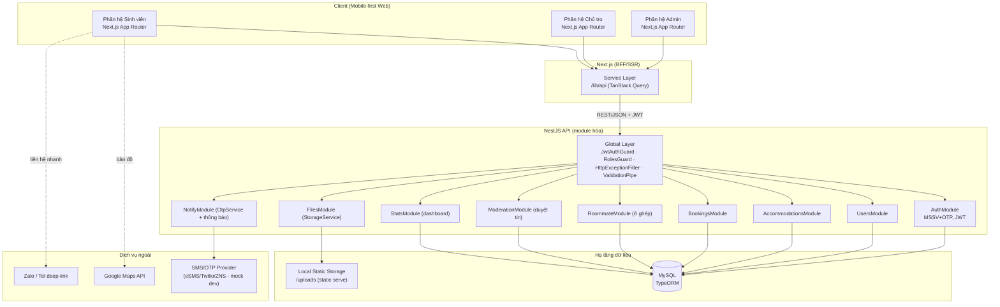
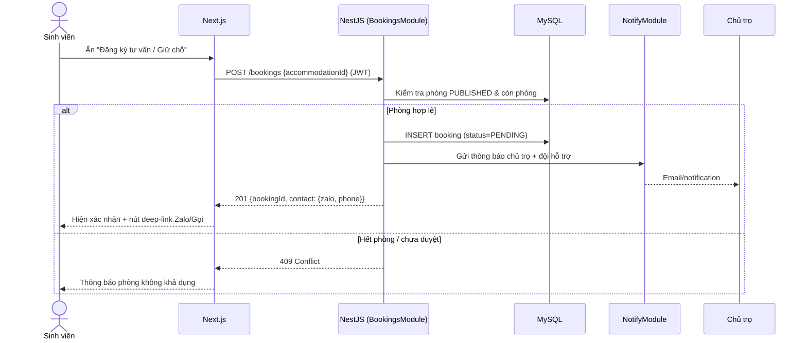
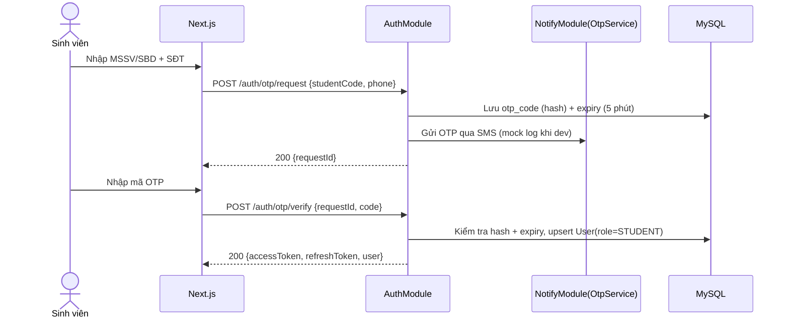
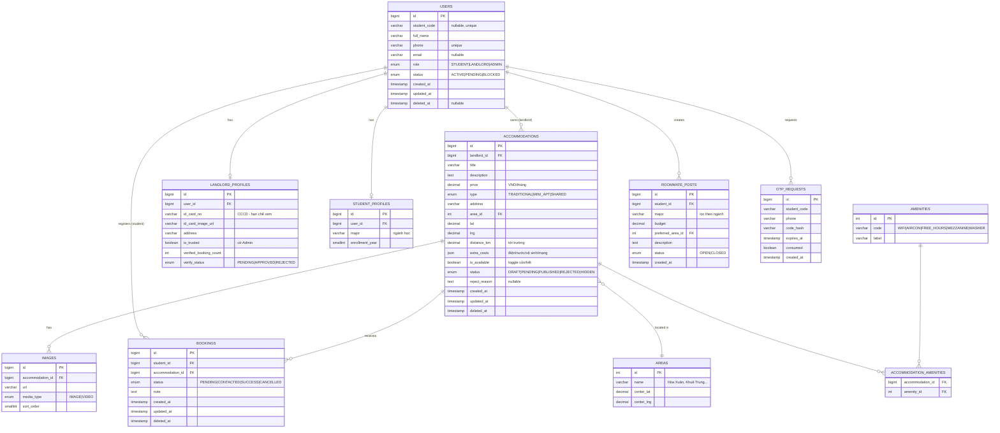

# Feature Plan — DAU Accommodation Link

> **Loại tài liệu:** Architecture & Design (Bước 3 — `/sc:design`)
> **Trạng thái:** Draft v1.0 — chờ Kỹ sư duyệt trước khi sang Bước 4 (Test-Design)
> **Ngày:** 2026-06-25 · **Persona:** Architect
> **Tham chiếu:** [brief.md](../brief.md)
> **Giả định mặc định đã áp dụng (phương án A):** MSSV tự khai + OTP · `OtpService` mock khi dev · "uy tín" = cờ Admin + đếm booking · Dashboard query khi tải + nút refresh · chỉ tiếng Việt · 1 VPS Linux.

---

## 1. Kiến trúc tổng quan (System Architecture)

### 1.1 Sơ đồ thành phần (Component Diagram)

### 1.2 Luồng "Đăng ký giữ chỗ" (Sequence Diagram)

### 1.3 Luồng "Đăng nhập MSSV + OTP" (Sequence Diagram)

### 1.4 Quyết định kiến trúc (Architecture Decisions)

| # | Quyết định | Lý do (WHY) |
|---|---|---|
| AD-1 | NestJS module hóa theo domain | Tách bạch, dễ test, đúng chuẩn dự án |
| AD-2 | `StorageService` interface (local impl trước) | Swap sang S3/Cloudinary sau không sửa business logic |
| AD-3 | `OtpService` interface + provider mock dev | Không phụ thuộc SMS provider khi phát triển/test |
| AD-4 | RBAC qua `@Roles` + `RolesGuard` | 3 vai trò rạch ròi, bảo vệ dữ liệu CCCD |
| AD-5 | Soft delete (`deleted_at`) toàn bộ bảng nghiệp vụ | Phục hồi dữ liệu, audit |
| AD-6 | Bài đăng có `status` (DRAFT/PENDING/PUBLISHED/REJECTED/HIDDEN) | Bắt buộc duyệt trước khi công khai (chống lừa đảo) |
| AD-7 | Tọa độ lưu `decimal(10,7)` lat/lng | Đủ chính xác cho bản đồ; lọc khoảng cách tính ở app-layer (MVP) |

---

## 2. Data Model

### 2.1 ERD

### 2.2 Ghi chú thiết kế bảng

- **Naming convention** (chuẩn dự án): table `snake_case` số nhiều; column `snake_case`; index `idx_<table>_<column>`.
- **Cột bắt buộc**: mọi bảng nghiệp vụ có `created_at` (`@CreateDateColumn`), `updated_at` (`@UpdateDateColumn`); soft delete `deleted_at` (`@DeleteDateColumn`) cho `users`, `accommodations`, `bookings`.
- **Index dự kiến**: `idx_users_phone`, `idx_users_student_code`, `idx_accommodations_status`, `idx_accommodations_area_id`, `idx_accommodations_price`, `idx_bookings_student_id`, `idx_bookings_accommodation_id`, `idx_otp_requests_phone`.
- **Dữ liệu nhạy cảm**: `landlord_profiles.id_card_no` & `id_card_image_url` chỉ Admin xem (không trả về API công khai); cân nhắc mã hóa cột giai đoạn 2.
- **Amenities & Areas** là bảng tra cứu (seed sẵn) → tách `src/database/seeds/`.
- **extra_costs** dùng JSON: `{ electricity, water, sanitation, internet }` (đơn vị VND, mô tả linh hoạt).

---

*(Tiếp theo: API Contract, Rollback plan & phân rã Jira — xem [feature-plan-api.md](./feature-plan-api.md))*
