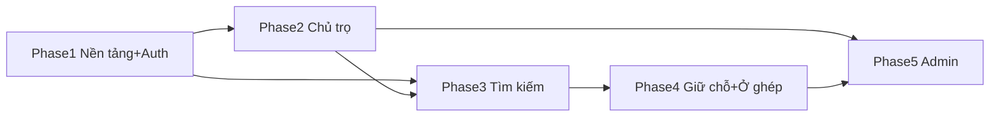

# Implementation Plan — DAU Accommodation Link

> **Loại tài liệu:** Implementation Plan (Bước 5 — `/sc:workflow --detail`) · **Persona:** Architect
> **Trạng thái:** Draft v1.0 · **Ngày:** 2026-06-25
> **Tham chiếu:** [feature-plan.md](../design/feature-plan.md) · [feature-plan-api.md](../design/feature-plan-api.md) · [test-cases.md](../test-design/test-cases.md)
> **Ranh giới:** Tài liệu kế hoạch — chưa thực thi code (code ở Bước 6).

---

## 0. Cấu trúc monorepo mục tiêu

```
dau-accommodation-link/
├─ apps/
│  ├─ api/                      # NestJS backend
│  │  ├─ src/
│  │  │  ├─ main.ts
│  │  │  ├─ app.module.ts
│  │  │  ├─ common/             # guards, filters, decorators, interceptors
│  │  │  ├─ config/             # env, typeorm config
│  │  │  ├─ database/
│  │  │  │  ├─ migrations/
│  │  │  │  └─ seeds/
│  │  │  └─ modules/
│  │  │     ├─ auth/  users/  accommodations/  bookings/
│  │  │     ├─ roommate/  moderation/  stats/  files/  notify/
│  │  └─ test/                  # (symlink/ref tới /tests)
│  └─ web/                      # Next.js frontend (App Router)
│     ├─ app/  (sv)/ (landlord)/ (admin)/
│     ├─ lib/api/               # service layer (TanStack Query)
│     ├─ components/  hooks/  stores/  (zustand)
│     └─ ...
├─ tests/                       # đã có skeleton (Bước 4)
├─ docs/
└─ package.json (workspaces)
```

---

## PHASE 1 — DAL-E1: Nền tảng & Auth

### 1.1 Scaffold monorepo (DAL-1)
- [ ] `package.json` root (npm workspaces: `apps/*`).
- [ ] `apps/api`: `nest new` (strict TS, ESLint, Prettier).
- [ ] `apps/web`: `create-next-app` (App Router, TS, Tailwind).
- [ ] `.editorconfig`, `.gitignore`, `.env.example` (DB, JWT_SECRET, UPLOAD_DIR, SMS_*).
- [ ] `apps/api/src/config/typeorm.config.ts` (MySQL, migrations path).
- [ ] `apps/api/src/common/filters/http-exception.filter.ts` (global).
- [ ] `apps/api/src/common/pipes` — bật `ValidationPipe` global (whitelist, transform).
- [ ] Swagger setup trong `main.ts` (`@nestjs/swagger`).
- [ ] Endpoint `GET /api/v1/health` → 200.
- [ ] Cấu hình Jest + Supertest, trỏ `tests/`.
- **Verify:** `npm run dev` chạy FE+BE; health 200; T-skeleton load được.

### 1.2 Migration & entities nền (thứ tự bắt buộc)
> Naming: `<timestamp>-<mô-tả>.ts`, mỗi file có `up()` + `down()`.
- [ ] M1 `create-users` → entity `users/entities/user.entity.ts`
- [ ] M2 `create-student-landlord-profiles`
- [ ] M3 `create-areas-amenities`
- [ ] M4 `create-accommodations`
- [ ] M5 `create-images`
- [ ] M6 `create-accommodation-amenities`
- [ ] M7 `create-bookings`
- [ ] M8 `create-roommate-posts`
- [ ] M9 `create-otp-requests`
- [ ] M10 `add-indexes` (idx_* theo design §2.2)
- [ ] Seeds: `src/database/seeds/` → areas, amenities, admin mặc định.

### 1.3 Auth (DAL-2, DAL-3, DAL-4)
- [ ] `notify/` — `OtpService` interface + `MockOtpProvider` (log dev) + `notify.service.ts`.
- [ ] `auth/dto/` — `request-otp.dto.ts`, `verify-otp.dto.ts`, `landlord-register.dto.ts`, `login.dto.ts` (class-validator).
- [ ] `auth/auth.service.ts` — sinh/hash OTP, verify, upsert user, ký JWT (access+refresh).
- [ ] `auth/auth.controller.ts` — endpoints §3.1 + `@ApiOperation/@ApiResponse`.
- [ ] `common/guards/jwt-auth.guard.ts`, `roles.guard.ts`; `common/decorators/roles.decorator.ts`, `current-user.decorator.ts`.
- [ ] `users/users.service.ts` + repository.
- **Test bật:** chuyển `it.todo` → `it` cho DAL-2/3/4 (auth.e2e-spec.ts), fail-fast.

---

## PHASE 2 — DAL-E2: Nguồn cung (Chủ trọ)

### 2.1 Accommodations CRUD (DAL-5, DAL-6)
- [ ] `accommodations/entities/accommodation.entity.ts` (+ enum status/type).
- [ ] `accommodations/dto/` — `create-accommodation.dto.ts`, `update-accommodation.dto.ts`, `toggle-availability.dto.ts`, `query-accommodation.dto.ts`.
- [ ] `accommodations/accommodations.service.ts` (tạo→PENDING; toggle owner-check).
- [ ] `accommodations/accommodations.controller.ts` (§3.2) + Swagger.
- **Test:** DAL-5, DAL-6 (accommodations.e2e-spec.ts).

### 2.2 Files / Upload media (DAL-7)
- [ ] `files/storage.service.ts` (interface) + `local-storage.service.ts` (lưu `/uploads`, serve static).
- [ ] Cấu hình `ServeStaticModule` cho `/uploads`.
- [ ] `images` entity + gắn vào accommodation; validate mime/size (Multer).
- **Test:** DAL-7.

---

## PHASE 3 — DAL-E3: Tìm kiếm (Sinh viên)

### 3.1 Smart Filter + chi tiết (DAL-8, DAL-9, DAL-10)
- [ ] `accommodations.service` — query builder: filter area/distance/price/type/amenities, chỉ `PUBLISHED`, phân trang.
- [ ] Endpoint `GET /accommodations`, `/:id`, `/areas`, `/amenities`.
- [ ] Serializer loại field nhạy cảm (CCCD) khỏi payload công khai.
- **Test:** DAL-8, DAL-9, DAL-10 (gồm T9-I1 không lộ CCCD, T8-I1 ẩn PENDING).

### 3.2 FE Sinh viên (Next.js)
- [ ] `lib/api/accommodations.ts` (service layer, TanStack Query).
- [ ] `app/(sv)/` — trang tìm kiếm + filter UI, list (mobile-first Tailwind).
- [ ] `app/(sv)/[id]` — chi tiết + Google Maps embed + chi phí.
- [ ] Auth UI: nhập MSSV/SĐT → OTP.

---

## PHASE 4 — DAL-E4: Giữ chỗ & Ở ghép

### 4.1 Bookings (DAL-11)
- [ ] `bookings/entities/booking.entity.ts` (+ enum status).
- [ ] `bookings/dto/create-booking.dto.ts`, `update-status.dto.ts`.
- [ ] `bookings.service.ts` — check PUBLISHED & isAvailable, chống duplicate, trả contact{zalo,phone}, gọi NotifyModule.
- [ ] `bookings.controller.ts` (§3.3) + Swagger.
- [ ] FE: nút "Giữ chỗ" + deep-link Zalo/Tel.
- **Test:** DAL-11 (gồm T11-I1 notify spy).

### 4.2 Roommate (DAL-12)
- [ ] `roommate/` entity + dto + service + controller (§3.4), lọc theo `major`.
- [ ] FE: trang tìm bạn ở ghép.
- **Test:** DAL-12.

---

## PHASE 5 — DAL-E5: Admin (Duyệt & Dashboard)

### 5.1 Moderation (DAL-13)
- [ ] `moderation/moderation.controller.ts` + service (§3.5): APPROVE/REJECT (reason bắt buộc khi reject), duyệt chủ trọ + set `is_trusted`.
- **Test:** DAL-13 (gồm T13-I1 end-to-end công khai sau approve).

### 5.2 Bookings Admin (DAL-14)
- [ ] Mở rộng `bookings.service` — list all + lọc status; cập nhật SUCCESS → tăng `verified_booking_count`.
- **Test:** DAL-14.

### 5.3 Stats Dashboard (DAL-15)
- [ ] `stats/stats.service.ts` — overview, price-distribution (bucket <1.5/1.5-2.5/>2.5), area-distribution, trusted-landlords.
- [ ] `stats/stats.controller.ts` (§3.6) ADMIN-only + Swagger.
- [ ] FE Admin: dashboard biểu đồ (refetchInterval / nút refresh), bảng duyệt tin.
- **Test:** DAL-15.

---

## Ma trận phụ thuộc (Dependency)


- Phase 1 chặn tất cả (auth + schema).
- Phase 3 cần Phase 2 (phải có dữ liệu phòng để tìm).
- Phase 5 cần Phase 2+4 (duyệt + thống kê booking).

## Checkpoint / Quality Gate mỗi Phase (Bước 7)
- [ ] 100% unit & integration test của Phase pass.
- [ ] Delta coverage code mới ≥ 80%.
- [ ] Lint + type-check sạch (không `any` vô lý, không warning).
- [ ] Mọi endpoint mới có Swagger đầy đủ (summary/desc/params/responses/≥1 example).
- [ ] Migration có `down()` đã test revert.

## Handoff
→ **Bước 6: `/sc:implement`** — thực thi theo thứ tự Phase 1 → 5, mỗi task chạy test ngay (fail-fast).
Đề xuất bắt đầu: **Phase 1.1 — Scaffold monorepo (DAL-1)**.
